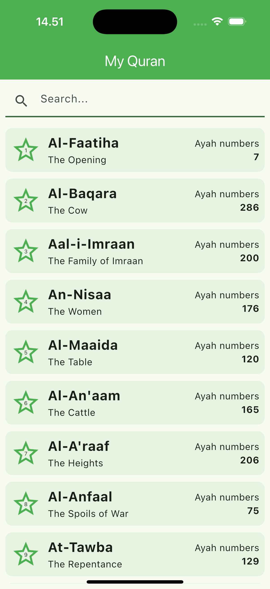
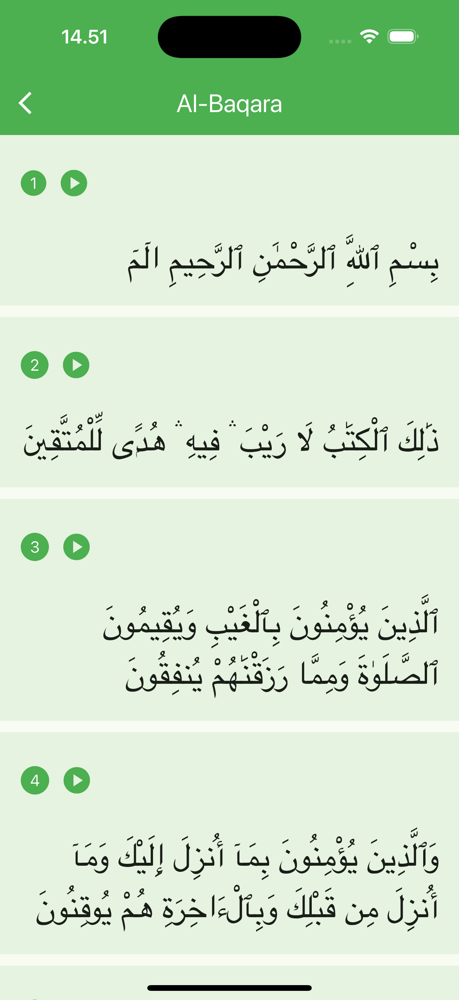
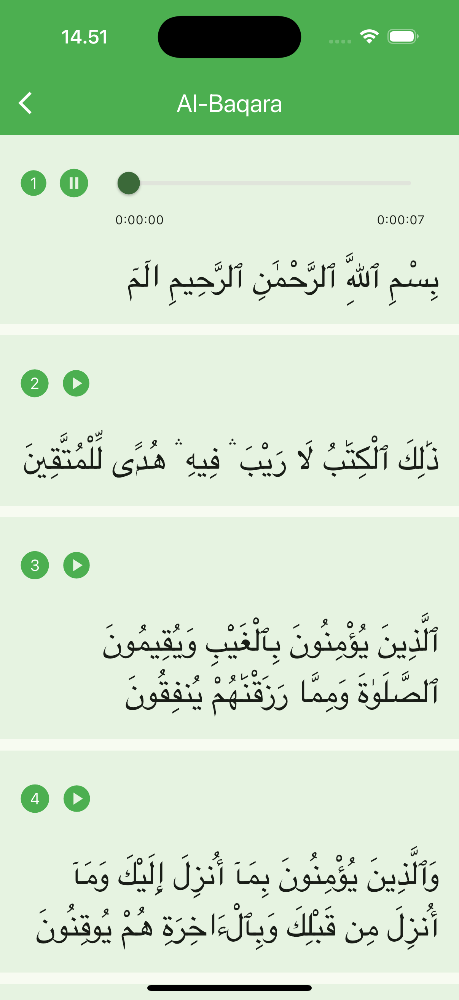

# My Quran
Aplikasi Flutter Quran yang memanfaatkan API dari Al Quran.

# Deskripsi
Aplikasi ini dibuat sebagai bagian dari Mobile App Technical Test.

# Fitur utama aplikasi:
- Menampilkan daftar surah dari API Al Quran Cloud
- Mencari surah berdasarkan nama
- Melihat detail surah dan daftar ayat
- Memutar audio ayat
- Pause audio
- Resume audio
- Menampilkan progress audio secara realtime
- Seek audio menggunakan slider
- Error handling
- Retry ketika request gagal

# Project Structure
lib/
├── core/
│   ├── di/
│   └── errors/
│
├── feature/
│   └── quran/
│       ├── data/
│       │   ├── datasource/
│       │   ├── models/
│       │   └── repository/
│       │
│       ├── domain/
│       │   ├── entities/
│       │   ├── repository/
│       │   └── usecases/
│       │
│       └── presentation/
│           ├── bloc/
│           ├── pages/
│           └── widgets/
│
└── main.dart

# Tech stack

# Im using BLoC for this project because:
- Memisahkan business logic dari UI
- Mudah di-maintain ketika aplikasi berkembang
- Mempermudah testing
- Cocok dengan Clean Architecture
- Memiliki alur data yang jelas melalui Event → State

Contoh implementasi BLoC pada aplikasi ini:
- SurahBloc
- SurahDetailBloc
- AudioBloc

# Clean Architecture
Project disusun menggunakan Clean Architecture agar:
- Dependency mengarah ke dalam (Dependency Rule)
- Mudah melakukan testing
- Mudah melakukan pengembangan fitur baru
- Memisahkan tanggung jawab tiap layer

# Dio
Digunakan sebagai HTTP Client karena:
- Mendukung interceptor
- Timeout handling
- Error handling yang lebih baik dibandingkan http package
- Mudah dikembangkan untuk kebutuhan production

# Just Audio
Digunakan untuk kebutuhan audio player karena:
- Mendukung audio streaming dari URL
- Mendukung play, pause, resume, dan seek

# Freezed
Digunakan untuk membantu pembuatan immutable model dan mengurangi boilerplate code.

# Flutter Launcher Icons
Digunakan untuk menghasilkan icon aplikasi secara otomatis untuk Android dan iOS sehingga tidak perlu melakukan konfigurasi manual pada masing-masing platform.

# Error Handling
Aplikasi memiliki custom error handling menggunakan:
- NetworkException
- TimeoutException
- ServerException
- UnauthorizedException
- NotFoundException
- UnknownException
Seluruh error dari Dio akan dimapping ke custom exception agar lebih mudah ditangani pada layer BLoC dan UI.

# Main Dependencies
| Package | Purpose |
|----------|----------|
| flutter_bloc | State Management menggunakan pola BLoC |
| dio | HTTP Client untuk komunikasi API |
| freezed | Membantu pembuatan immutable model dan mengurangi boilerplate code |
| freezed_annotation | Annotation untuk Freezed |
| json_annotation | Annotation untuk serialisasi JSON |
| json_serializable | Generate fungsi fromJson dan toJson secara otomatis |
| build_runner | Menjalankan proses code generation |
| equatable | Value Equality untuk Event, State, dan Entity |
| just_audio | Audio player untuk play, pause, resume, dan seek audio |
| flutter_launcher_icons | Generate app icon Android dan iOS secara otomatis |

# Alasan Pemilihan Arsitektur
Clean Architecture + BLoC karena:
- Scalability yang baik
- Separation of Concerns yang jelas
- Mudah melakukan testing
- Mudah mengganti implementasi data source tanpa mengubah business logic

# Feature
- # Surah List
    - Menampilkan list surah dari API
- # Search
    - Pencarian surah by name
- # Surah Detail
    - Menampilkan daftar ayat pada surah yang dipilih
- # Audio Player
    - Play
    - Pause
    - Resume
    - Stop
    - Progress Indicator
    - Duration Display
    - Seek Slider

# How to run this app 
- Pull from repository
- run this command from your terminal or cmd
    - flutter clean
    - flutter pub get
    - dart run build_runner build --delete-conflicting-outputs

# Screenshots
<table>
  <tr>
    <td align="center">
       
      <b>Home Page</b>
    </td>
    <td align="center">
       
      <b>Detail Surah</b>
    </td>
    <td align="center">
       
      <b>Audio Player</b>
    </td>
  </tr>
</table>
